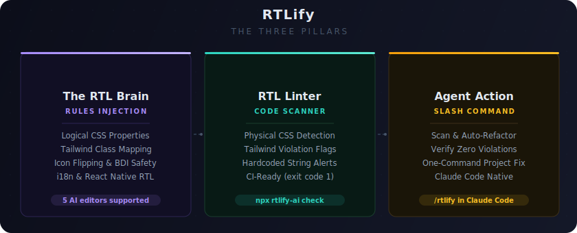
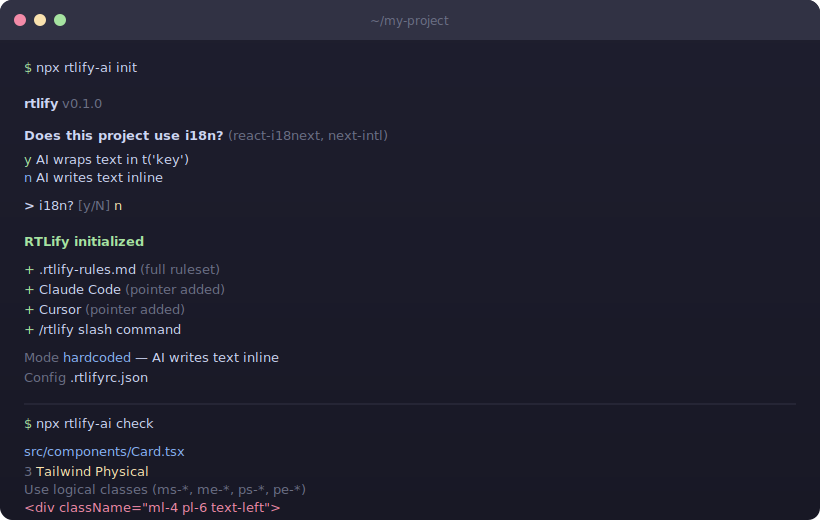

<div align="center">

<br/>

# RTLify

### The RTL Brain for AI Coding Agents

Teach your AI editor once — it generates production-ready<br/>RTL code from that point on. No plugins. No runtime. One command.

<br/>

[](https://www.npmjs.com/package/rtlify)
[](LICENSE)
[](package.json)
[](#supported-ai-platforms)
[](#core-features)
[](package.json)

<br/>

**Hebrew** · **Arabic** · **Persian (Farsi)** · **Urdu**

<br/>



<br/>

</div>

<br/>

## The Core Idea

**RTLify doesn't fix code after generation — it prevents incorrect code from being generated in the first place.** Teach your AI once instead of fixing every component manually.

> **RTLify is not an i18n library.** It's an AI behavior layer — zero runtime dependencies — that ensures your coding agent uses correct RTL patterns and respects your existing localization setup.

<br/>

## Why

Every AI coding agent is trained on LTR codebases. Ask it to build an RTL interface and it will:

**CSS & Layout**
- `margin-left` instead of `margin-inline-start`
- `ml-4` in Tailwind instead of `ms-4`
- `paddingLeft` in React Native instead of `paddingStart`

**Text & Bidi**
- Hardcoded `"ברוכים הבאים"` or `"مرحباً"` without translation functions
- Mixed Hebrew + numbers without `<bdi>` tags — content jumps around
- US locale for dates and currency

**Components**
- Arrows and chevrons pointing the wrong way
- Carousels, charts, and sliders rendering backwards

...and dozens of subtle bugs that slip into production.

<br/>

## Quick Start

```bash
npx rtlify init
```

Run once per project. After that, just code normally — your AI editor reads the rules automatically in the background.

<br/>

## Supported AI Platforms

<table>
<tr>
<td align="center"><strong>Claude Code</strong><br/><sub>CLAUDE.md + /rtlify</sub></td>
<td align="center"><strong>Cursor</strong><br/><sub>.cursorrules</sub></td>
<td align="center"><strong>Windsurf</strong><br/><sub>.windsurfrules</sub></td>
<td align="center"><strong>Cline</strong><br/><sub>.clinerules</sub></td>
<td align="center"><strong>Copilot</strong><br/><sub>copilot-instructions.md</sub></td>
<td align="center"><strong>Gemini CLI</strong><br/><sub>GEMINI.md</sub></td>
<td align="center"><strong>Codex CLI</strong><br/><sub>AGENTS.md</sub></td>
</tr>
</table>

### Supported Frameworks

**React & Next.js** · **Vite** · **React Native** · **Vanilla JS/TS** · **Tailwind CSS v3 & v4**

<br/>

## How It Works

<div align="center">

</div>

<br/>

There is no black box. RTLify saves the full ruleset to `.rtlify-rules.md` and adds a short 3-line pointer to your editor config files. Your config stays clean — the AI knows where to find the rules. Open `.rtlify-rules.md` and read exactly what the AI sees.

### Step 1 — 🧠 The Injection

```bash
npx rtlify init
```

Installs the **RTL Brain**: 8 architecture rules with **"do this / not that"** code examples and a full Tailwind class mapping table. The AI reads them automatically — no extra prompting.

### Step 2 — 🔍 The Audit

```bash
npx rtlify check
```

```
  src/components/Sidebar.tsx
       3 Tailwind Physical
         Use logical classes (ms-*, me-*, ps-*, pe-*)
         <div className="ml-4 pl-6 text-left">

  1 violation across 1 file
```

Exits with code 1 — plug it into CI.

### Step 3 — 🪄 The `/rtlify` Command

Type **`/rtlify`** in Claude Code. It will:

1. Run `npx rtlify check` to find violations
2. Apply targeted fixes — CSS to logical, icons flipped, `<bdi>` tags added
3. Re-run the check to confirm zero violations

> **Safe by default:** scoped to RTL layout fixes only. Never extracts strings to `t()`. Never invents translation keys. Never introduces undefined imports. Every fix is reviewable in a standard diff.

<br/>

## Core Features

What the RTL Brain teaches your AI agent:

| | Feature | What the AI Learns | Example |
|---|---|---|---|
| 1 | **Logical CSS** | Replace physical properties with logical | `margin-left` → `margin-inline-start` |
| 2 | **Tailwind Mapping** | 20+ class conversions | `ml-4` → `ms-4`, `text-left` → `text-start` |
| 3 | **Icon Flipping** | Flip directional icons only | `rtl:-scale-x-100` on arrows/chevrons |
| 4 | **BDI Safety** | Wrap LTR in RTL with `<bdi>` | `<bdi>#12345</bdi>` stays anchored |
| 5 | **Localized Formats** | `Intl` APIs with correct locales | `Intl.NumberFormat('he-IL')` → `42.90 ₪` |
| 6 | **Safe i18n** | `t()` only if project has i18n | Never auto-extracts, never breaks builds |
| 7 | **Complex Components** | RTL-aware carousels, charts, sliders | `<Swiper dir="rtl">` |
| 8 | **React Native** | Mobile RTL APIs | `paddingStart`, `I18nManager.isRTL` |

<br/>

## Try It

After `npx rtlify init`, try these prompts:

> 💬 **"Build a checkout form in Hebrew"**
>
> AI uses `ms-4` instead of `ml-4`, formats prices with `Intl.NumberFormat('he-IL')`, wraps text in `t('checkout.total')`.

> 💬 **"Create a React Native settings screen in Arabic"**
>
> AI uses `paddingStart` instead of `paddingLeft`, checks `I18nManager.isRTL` for icon transforms, sets `writingDirection: 'rtl'`.

> 💬 **"Show: 'ההזמנה שלך #12345 אושרה'"**
>
> Order number renders as `<bdi>#12345</bdi>` — stays anchored correctly.

<br/>

## 🎮 Playground

```bash
git clone https://github.com/idanlevi1/rtlify.git
cd rtlify/examples/playground
npx rtlify check
```

`BrokenDashboard.tsx` has 11 intentional RTL violations. The linter catches all of them.

<br/>

## Contributing

We welcome contributions! Here's how to get started:

```bash
# 1. Clone & build
git clone https://github.com/idanlevi1/rtlify.git
cd rtlify
npm install
npm run build

# 2. Project structure
src/
├── cli.ts              # CLI entry — commands, patterns, templates, editor detection
└── rules.md            # 8 RTL rules (Rule 6 is a dynamic placeholder)

examples/playground/
└── BrokenDashboard.tsx # Test file with intentional violations

# 3. Test your changes
node dist/cli.js init          # Test init in a temp folder
node dist/cli.js check         # Run linter against playground
node dist/cli.js help          # Verify help output

# 4. Key files to know
# ARCHITECTURE.md              How everything connects (start here!)
# .rtlifyrc.json               Generated config (i18n vs hardcoded mode)
# .rtlify-rules.md             Generated full ruleset (single source of truth)

# 5. Submit a PR
git checkout -b feat/your-feature
git commit -m "feat: description"
git push -u origin feat/your-feature
gh pr create
```

Read [ARCHITECTURE.md](ARCHITECTURE.md) before diving in — it covers the data flow, key design decisions, and gotchas that will save you time.

<br/>

---

<div align="center">

RTLify is a step toward making AI-generated UI fully localization-aware — not just RTL-correct.

<br/>

Built by **[Idan Levi](https://github.com/idanlevi1)** · If RTLify helped you, give it a ⭐

<br/>

**[MIT License](LICENSE)**

</div>
